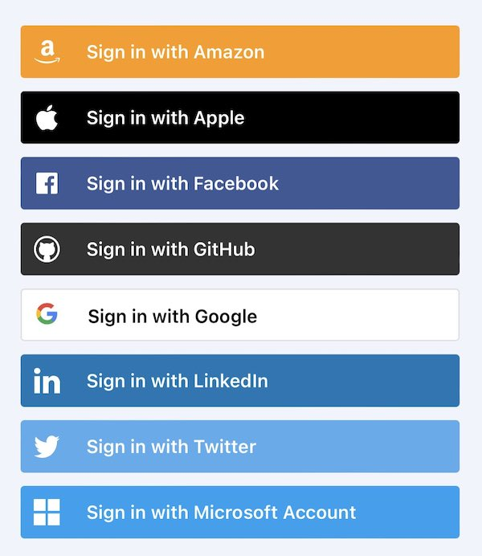

We define the term *provider* in this context to be a trusted intermediary service used by a person as they interact with an app/site (*app*). That app might be playing the role of relying party, service, provider, VC issuer, VC verifier, or other roles. Examples of providers include:

- Authorization providers (e.g. OpenID Connect) that allows a person to log in to the app by leveraging the Authorization performed by, say, the person's Google Account's Authorization Server
- Age verification providers
- Digital wallets that act as self-issued identity providers and allow the holder to log in and prove information about themselves

Individuals are free to adopt whatever providers they wish from among many alternatives. However, this creates a problem for the app developer: **how does the app know which provider the person would like to use?** The app developer is faced with two choices:

- **Bad**: Ask the person to pick their provider from a list of alternatives that the person might use. 
- **Ugly**: Ask the person to enter an identifier of their provider. Experience has shown this to be unworkable.

If an app could discover the provider's capabilites, it could do things like:

- Ask the provider to perform services on behalf of the person
- Discover the image to display in a button representing the provider
- Adapt its content based on information learned about the person from the provider

But this begs the question, **how does the app discover the provider's capabilities?**. 

These two questions have not been answered in a general way, although partial answers exist:

- SIOPv2 answers the questions by defining [Dynamic Discovery of Self-Issued OpenID Provider Metadata](https://openid.net/specs/openid-connect-self-issued-v2-1_0.html#section-6.1)
- OpenID Connect answers by defining [OpenID Connect Discovery](https://openid.net/specs/openid-connect-discovery-1_0.html) but has not been widely adopted. See the next section.

### Authorization providers and the NASCAR problem

An app instead of, or in addition to, authenticating the person using a username and password may choose to rely on an external OpenID Connect-compatible Authorization Server (provider) and it authentication and authorization of the person. Theoretically, the app could implement [OpenID Connect Discovery](https://openid.net/specs/openid-connect-discovery-1_0.html) but due to usability issues it has not been widely adopted. 

Instead, the app displays a button for each provider. However, if there are too many options the resulting site starts to look like a car at NASCAR which is ugly, confusing, and inconvenient.

There are dozens of OpenID Connect Authorization providers each with its own logo-ed button such as Continue-with-Google, Continue-with-Twitter, -Apple, -Facebook, -LinkedIn, and so on. 

The problem is exacerbated by protocols like OpenID SIOP that allow each person to have a *personal identity provider* (aka a wallet) from one of hundreds of alternative wallet providers. 

The app doesn't know which authorization provider the person would like to use before the person is looking at the initial app/site screen. The NASCAR problem would be solved if the app could (i) discover a priori the set of authorization providers the person has available and (ii) find one or more matches with the set of authorization providers the app/site supports and then (iii) display only the matches. The result would be a small, although hopefully not the null, set of alternatives and the app would display a button for each. 