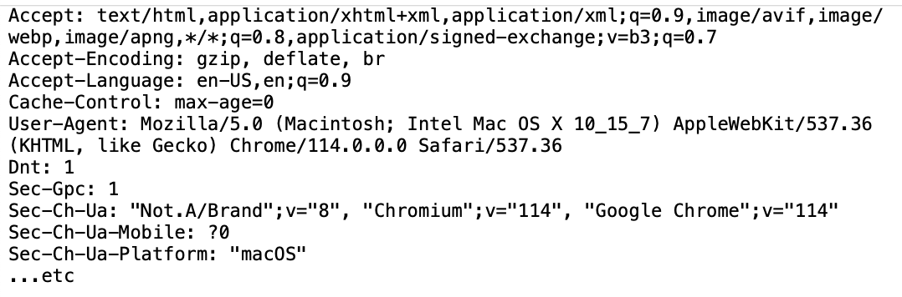

## HTTP request header

The HTTP request header could be considered a partial solution to the same problem Agent Presentation addresses. The "agent" in this case is the browser (aka user agent). Rather than redirect to config file (as in Agent Presentation), all information is included inline. 

Specifically websites need to discover information about the person's browser and operating system capabilities. To address this need, websites read field values from the HTTP request header inserted by the browser. The header typically includes, among others, a "User-Agent" field that indicates the person's browser version, the operating system the person is using, etc. The site uses these HTTP fields to understand the capabilities of the browser, default language, cookies, etc. An example is shown below.

### Client Hints

[Client Hints were introduced by Google](https://developer.chrome.com/en/articles/user-agent-client-hints/) to improve on the User-Agent string in the HTTP request header. Client hints are a set of HTTP request header fields that a server can proactively request from a client to get information about the device, network, user, and user-agent-specific preferences. The server can determine which resources to send, based on the information that the client chooses to provide. 

