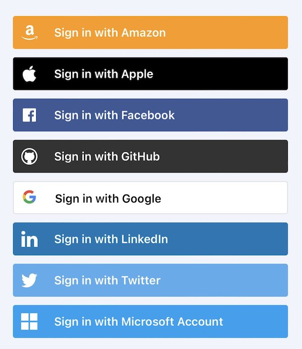

Let's define the term "agent" as trusted digital intermediary between a individual and an app/site ("app"). Examples of agents include:

- Digital wallets that allow a person to log in and prove information about themselves
- Traditional OpenID Connect services (e.g. "Continue with Google") that allows a person to log in to the app by leveraging their existing Google account

Individuals are free to adopt whatever agents they like from among many alternatives. This creates a problem for the app developer: **how does the app know which agent the person would like to use?** The app developer is faced with two choices:

- **Bad**: Ask the person to pick their agent from a list of alternative agent types that the person might use. 
- **Ugly**: Ask the person to enter an identifier of their agent. This has in practice proven to be unworkable.

A related question is: **how does the app discover the agent's capabilities?**. 

Once the app can discover the agent's capabilites it the app can do things like:

- Ask the agent to perform services on behalf of the person
- Discover the image to display in a button representing the agent
- Adapt its content based on information learned about the person from the agent

These questions have not been solved in a general way, although partial solutions exist.

### Authentication services and NASCAR

An app instead of, or in addition to, authenticating the person using a username and password may choose to rely on external authentication services  (e.g. Continue-with-Google, -Facebook, etc.). The app displays a button for each service. However, if there are too many options the resulting site starts to look like a car at NASCAR. This is ugly, confusing, and inconvenient.

For example, there are dozens of OpenID Connect IdPs each with its own logo-ed button such as Continue-with-Google, Continue-with-Twitter, -Apple, -Facebook, -LinkedIn, and so on. 

The problem is exacerbated by new protocols like OpenID SIOP that allow each person to have a *personal IdP* (aka a wallet) from one of hundreds of wallet providers. 

The app doesn't know what authentication alternative the person would like to use before the person is looking at the initial app/site screen. The NASCAR problem would be solved if the app could (i) discover a priori the set of authentication methods the person has available and (ii) find one or more matches with the set of authentication methods the app/site supports and then (iii) display the matches. The result would be a small, although hopefully not the null, set of alternatives. The app would then display a button for each.